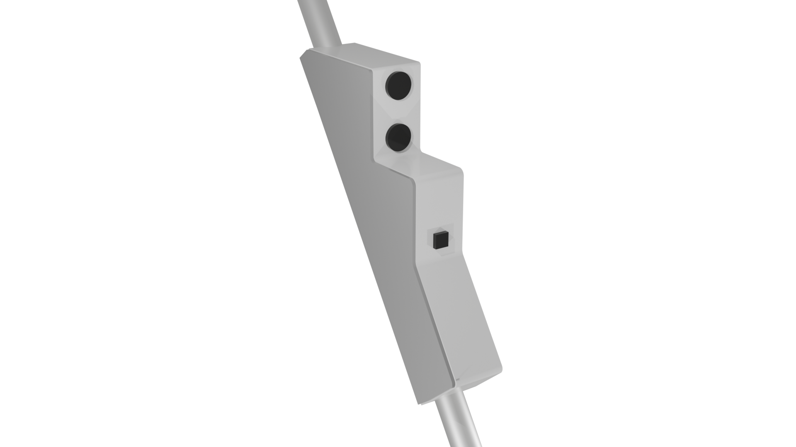
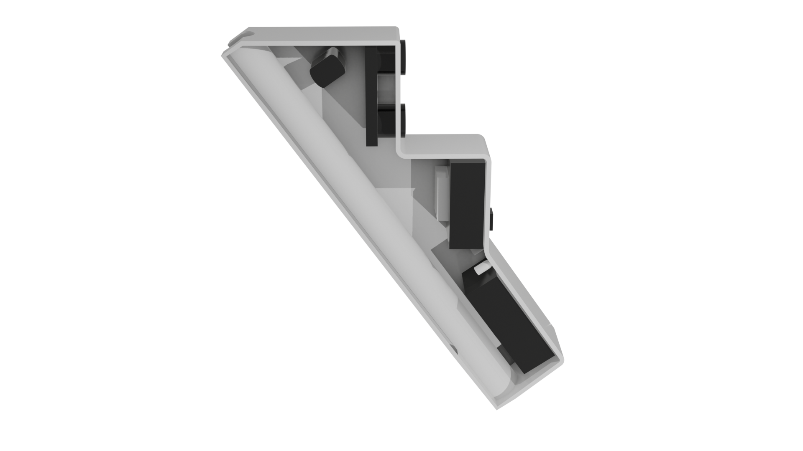
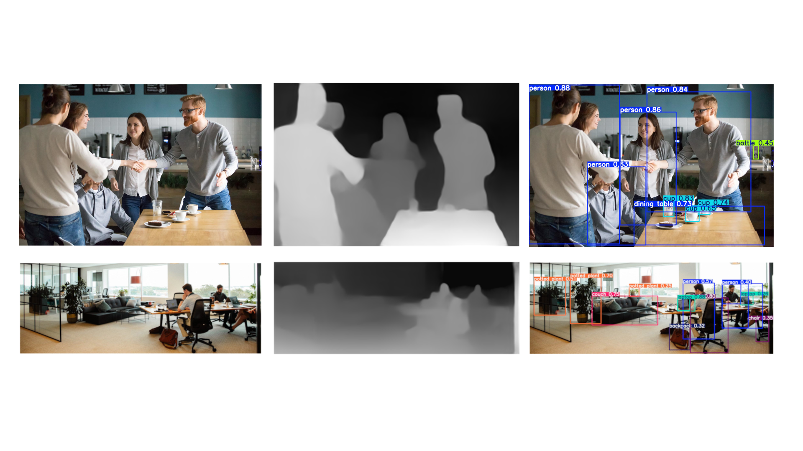

PT-BR
# bengala-fecaf
Projeto com Arduino + Servidor que identifica objetos pertos de colidir, usando ESP32, YOLOv5nu e MiDas.

---------

## Motivação

Pessoas com deficiência visual enfrentam desafios diários para se locomover com segurança. Apesar das bengalas e cães-guia, obstáculos inesperados ainda representam riscos. Esse projeto visa oferecer uma solução acessível e eficiente para detecção de objetos próximos, alertando os usuários antes de uma possível colisão.

#### Por quê?
Surge da necessidade de aumentar a autonomia, segurança e acessibilidade para pessoas com deficiência visual, além de promover a inclusão social, reduzindo riscos e facilitando a locomoção.

#### Para quem?
Deficientes visuais, Este sistema é projetado para pessoas cegas ou com baixa visão, auxiliando na mobilidade segura em ambientes internos e externos.

#### Como?
O projeto consiste em um equipamento com dois sensores, sendo o sensor ultrassônico HCSR04, que permite detectar distâncias até 4 metros, e uma câmera ESP32, que captura as imagens, e usando a internet, envia elas ao servidor, este servidor processa as imagens com o YOLOv5nu (detecção de objetos) e o MiDas (profundidade de campo) e retorna ao ESP32 avisando se tem objetos próximos na imagem ou não. Além dos sensores, o equipamento conta com um motor de vibração para alertar o usuário se tiver objetos perto, vibrando a bengala, e sua bateria (uma pilha de 9V). Para melhor teste do equipamento, ele também utiliza dois LEDs, um para trâfego e indicação de resultados no código, outro para erros e saber se está ligado corretamente.

---------

## Funcionamento

1. O ESP32 faz a leitura do sensor ultrassônico HCSR04, verificando se ele indentificou objetos próximos.

2. ESP32-CAM captura imagens a cada 500ms e as envia para um servidor FastAPI/Flask via Wi-Fi (neste projeto, a rede é LAN).

3. Servidor processa as imagens usando YOLOv5nu e MiDas, detectando objetos.

4. Se tiver objetos perto, é indicado pela vibração no dispositivo.

#### Hardware

Componentes do Hardware:
- ESP32: Câmera e mini arduino, sendo programável em C# pelo Arduino IDE (Precisa de conversor UART).
- Sensor ultrassônico HCSR04: Sensor ultrassônico com trigger e echo, um dos mais famosos e utilizados.
- Motor cc: Um mini motor cc, simples, ligado ao ESP32 por meio de um transistor NPN (BCE) para não ter problemas de corrente elétrica.
- LEDs: Luzes apenas para testes e verificação de erros.
- Bateria: Bateria 9V para energizar tudo.

#### Software

Softwares que estamos usando e bibliotecas/repositórios:

- YOLOv5nu: IA de reconhecimento de objetos na imagem.
- MiDas: IA de profundidade baseada em imagens únicas.
- Flask/FastAPI: Forma de comunicação do servidor com requisições do ESP32, este deixa a utilização dos serviços online mais rápido.

#### Arduino

Configura o ESP32-CAM (AI-Thinker) para capturar imagens e enviá-las para o servidor Flask.

* Conecta-se ao Wi-Fi usando o SSID e senha.
* Inicializa a câmera, ajustando brilho, contraste e qualidade da imagem.
* Faz leitura do HCSR04 para saber se tem objetos perto.
* Captura imagens a cada 500ms e envia para o servidor Flask:
1. O ESP tira uma foto usando a câmera.
2. Converte a imagem para o formato JPEG.
3. Envia a imagem via HTTP POST para `http://localhost/processar`.
4. Exibe no Serial Monitor a resposta do servidor.

#### Servidor
Recebe imagens enviadas pelo ESP32-CAM.
* Carrega os modelos MiDas e Yolov5nu
* Servidor: `http://localhost/processar`.
1. Salva a imagem em photos/output.png
2. Processa a imagem com o YOLOv5nu para detectar objetos.
3. Processa a imagem com o MiDas para pegar a profundidade e a distância mais próxima.
3. Exibe os resultados no terminal.
4. Retorna para o Esp32, com um valor de 0 a 255, indicando a proximidade mínima.

## Melhorias já implementadas

1. Melhoria na IA (Yolo): Escolhemos uma versão mais leve do Yolo, baseados em testes diretos no servidor, assim optando pelo Yolov5nu
2. Melhoria no delay: Melhoramos o delay do sistema inteiro, usando distribuição em Multithreading, juntamente com a forma de conexão do Esp32 com o servidor. Conseguimos agilizar todo o sistema (excluindo o processamento do yolo) para +30 fps com 128x128 - 79%.
3. Design: Conseguimos modificar o design para melhor leituras, em forma de escada.
4. Conexões físicas: estamos melhorando as conexões do projeto para que tenha menos problemas físicos com conexões e cabeamentos.
5. Uso do ML-DEPTH-PRO/Midas: Ao buscar por utilizar o Ml-Depth-Pro, encontramos uma solução mais simples e eficiente, sendo o Midas, e conseguimos implementar ele no nosso sistema.
6. Forma de cálculo e retorno: Conseguimos usar o cv2 para processar a imagem do MiDas e retornar um valor numérico indicando ao Esp32 se tem objetos próximos ou não, faltando apenas calibrar com os testes físicos.

## Melhorias a serem implementadas no semestre 1/2025

1. Uso do Pico 2: Usar o Rasperry PI para processamento direto, sem necessidade do servidor.
2. Design: Diminuir o design e encontrar uma forma que fique os sensores precisos e o desenho agradável, melhorando também o peso e ergonomia.
3. Melhoria no sonar: Trocar o HCSR04 por algum sensor mais potente e preciso, como sensores TOF e Lidar mais robustos.
4. Implementação de um novo sensor: Usar um sensor novo de infravermelho, com precisão atém 1,5 metros, na parte de baixo da bengala.

## Como configurar o projeto

Existe dois arquivos principais, o que vai no arduino e o que roda o servidor.

#### Arduino

Mude no CONFIG HERE, colocando o nome da sua rede onde o servidor e o Esp32 vão conectar, a senha e seu ip.
Para obter seu IP, abra o cmd e use o comando `ipconfig` , assim pegue o ipv4 da sua placa de rede (normalmente algo como 192.168.10.3) e cole no ipv4 do arduino.
Caso seu Esp32 tenha mais que 512kb de memória RAM, pode tentar diminuir o delay para acelerar o envio de imagens e processamento, mas a entrega de performance não é garantida, e pode levar a constantes crashs no sistema de gerenciamento de memória do Esp32, dando erros como `pbuf_free`.

#### Servidor
Apenas rodar o servidor já é suficiente, executando o main.py, mas segue os comandos disponíveis para cada biblioteca:

Yolo:
- Atributos:
    - modelo = nome do modelo que esteja salvo dentro do server/BengalaFecaf/weights
- Comandos
    - treinar(yaml, qualidade, fatoracao) = Passar o pacote de treinamento (como o "coco8.yaml"), a qualidade do modelo em partes (como 640), e a fatoração, também chamada de epochs, (como 100).
    - carregar() = carrega o modelo na memória RAM.
    - avaliar() = avalia uma imagem passando seu path.
- Inicialização
    - Por padrão, ele já utiliza um modelo yolov5nu.

Midas:
- Atributos:
    - modelo = nome do modelo que esteja salvo dentro do server/BengalaFecaf/weights
    - tipo_modelo = tipo do modelo, normalmente é só o nome do modelo sem o .pt e o path dele.
- Comandos
    - carregar() = carrega o modelo na memória RAM.
    - avaliar() = avalia uma pasta de imagens passando seu path.
- Inicialização
    - Por padrão, ele já utiliza um modelo midas_v21_256.

Server:
- Atributos:
    - yolo = atributo para receber seu yolo, por padrão ele fica vazio.
    - midas = atributo para receber seu midas, por padrão ele fica vazio.
- Comandos
    - iniciar() = carrega os modelo se não tiverem sido carregados e se existirem, abre o servidor e faz o processamento das requisições que chegarem.
- Inicialização
    - Por padrão, não carrega nenhum modelo.